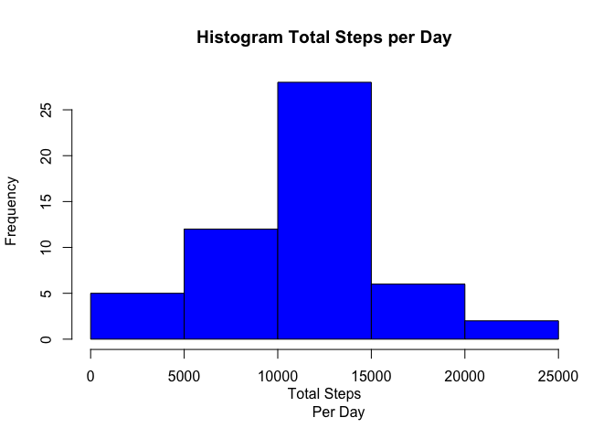
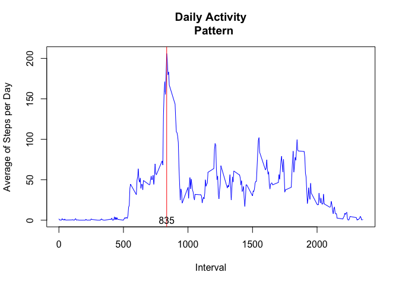
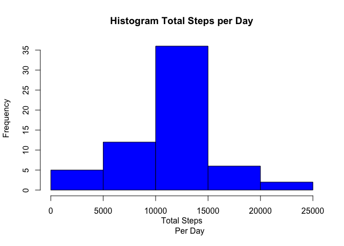
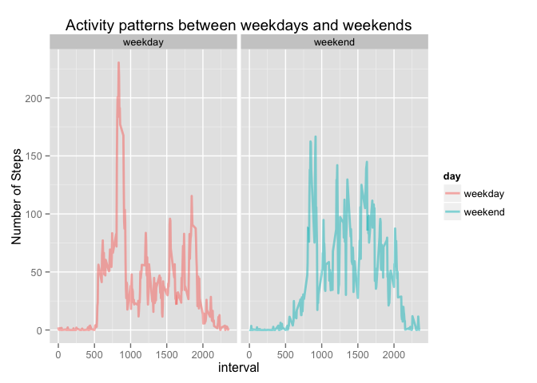

# Reproducible Research: Peer Assessment 1

==================================================================================

## Loading and preprocessing the data

```r
  dataWithNAS  <- read.csv("activity.csv")
  # Remove NAs
  data <- subset(dataWithNAS, !is.na(steps))
```

## What is mean total number of steps taken per day?

```r
  table  <- aggregate(data$steps, by = list(date = data$date), FUN = sum)
  #Filter the NAs
  hist(table$x, main = "Histogram Total Steps per Day", xlab = "Total Steps
       Per Day", col = 'blue')
```

 


```r
# Mean
meanSteps  <- mean(table$x)
meanSteps
```

```
## [1] 10766.19
```

```r
# Median
medianSteps  <- median(table$x)
medianSteps
```

```
## [1] 10765
```

## What is the average daily activity pattern?

```r
  tableDailyActivity  <- aggregate(data$steps, by = list(interval = data$interval   
                                  ), FUN = mean)
  temp <- tableDailyActivity[tableDailyActivity$x == max(tableDailyActivity$x),]
  
  plot(tableDailyActivity$interval, tableDailyActivity$x, main = "Daily Activity
  Pattern", xlab = "Interval", ylab = "Average of Steps per Day", 
  col = 'blue', type = 'l')  
  abline(v = temp$interval, col = "red")
  text(temp$interval, 0, labels= temp$interval, col = "black")
```

 

**The 5-minute interval: 835 , on average across all the days in the dataset, contains the maximum number of steps: 206.1698113**

## Imputing missing values

```r
  # Report the number of NA rows
  nas <- nrow(dataWithNAS[is.na(dataWithNAS$steps),])
```

**The number of NAs in the Dataset is: 2304**

The strategy used to fill the NA's values in the dataset is to fill the mean for that 5-minute interval over all days.


```r
  dataWithNAS2  <- dataWithNAS
  for (i in 1:length(tableDailyActivity$interval)) {
    
    len  <- length(dataWithNAS2[(is.na(dataWithNAS2$steps) & dataWithNAS2$interval == 
    tableDailyActivity$interval[i]),]$steps)
    
    dataWithNAS2[(is.na(dataWithNAS2$steps) & dataWithNAS2$interval == 
    tableDailyActivity$interval[i]),]$steps  <- rep(tableDailyActivity$x[i],len)
  }
```

```r
  table2  <- aggregate(dataWithNAS2$steps, by = list(date = dataWithNAS2$date), FUN = sum)
  #Filter the NAs
  hist(table2$x, main = "Histogram Total Steps per Day", xlab = "Total Steps
       Per Day", col = 'blue')
```

 


```r
# Mean
meanSteps2  <- mean(table2$x)
meanSteps2
```

```
## [1] 10766.19
```

```r
# Median
medianSteps2  <- median(table2$x)
medianSteps2
```

```
## [1] 10766.19
```

**These values differ from the estimates from the first part of the assignment. Now mean and median are the same. Imputing missing data on the estimates of the total daily number of steps introduce less bias.**

## Are there differences in activity patterns between weekdays and weekends?

```r
  # Create a new factor variable in the dataset with two levels – “weekday” and “weekend”
  # indicating whether a given date is a weekday or weekend day.
  dataext  <-  data.frame(day = weekdays(as.Date(dataWithNAS2$date)), dataWithNAS2)
  dataext <- transform(dataext , day = ifelse((day == "Saturday" | day == "Sunday"), 
                       "weekend", "weekday"))
  dataext  <- transform(dataext, day = as.factor(day))

  # Compute the average of total number steps per interval per weekend or weekday
  table3  <- aggregate(dataext$steps, by = list(interval = dataext$interval, 
                      day = dataext$day), FUN = mean)

  # Make de plot
  library("ggplot2")
  g <- ggplot(table3, aes(interval, x))
  g <- g + geom_line(aes(color = day), size = 1, alpha = 1/2)
  g <- g + ggtitle("Activity patterns between weekdays and weekends")
  g <- g + ylab("Number of Steps")
  g <- g + facet_grid(. ~ day)
  g
```

 

**Differences in activity patterns between weekdays and weekends shows more activity on the intervals from 500 to 1000 during weekdays**

